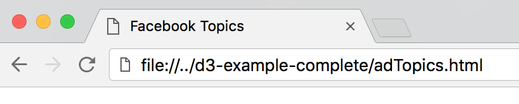

# D3.js Examples - Complete

This was created during my time as a student at Code Chrysalis.
Three examples of using D3 with facebook data.

## Examples

* adTopics.html : simple example showing how to add divs with an array
* postDates.html : barchart example showing how to use scale
* ipAddresses.html : pie chart layout

### Prerequisites

After forking and cloning the repository you can open each html file up directly in a browser and see the examples working.



Because d3 uses the [Fetch API](https://developer.mozilla.org/en-US/docs/Web/API/Fetch_API) which uses [CORS](https://developer.mozilla.org/en-US/docs/Web/HTTP/CORS) serving local files is blocked - for good reason, but it can be annoying.

The workaround for these examples is to use [Github Gist](https://gist.github.com/). The data for all of these examples is pubic, but not published
The files being used in this example are:

[topics.json](https://gist.github.com/SQLMD/9936555bce2145af08ea3a7da3410581)

[your_posts_sample.json](https://gist.github.com/SQLMD/98539c0f69d6d694273973070aad590a.js)

[account_activity_sample.json](https://gist.github.com/SQLMD/ae7a2e860a5231081d7d089371e0c777.js)

Another possible solution is to start a web server in the same directory using python :

```
python -m SimpleHTTPServer 8080
```

and then local files can be accessed by going to localhost:8080
